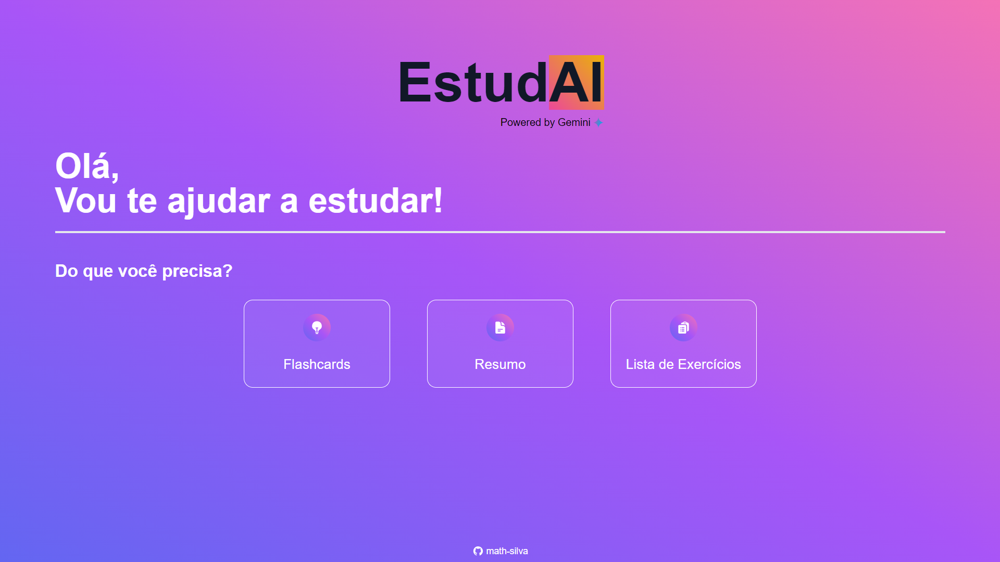

# EstudAI

EstudAI é um projeto que tem como objetivo ajudar estudantes a estudar de forma mais eficiente e organizada. A aplicação utiliza a API do Google Gemini e gera flashcards, resumos e listas de exercícios personalizadas com base no conteúdo, matéria e nível de escolaridade informados pelo usuário.

_O Projeto foi desenvolvido para a Imersão IA da Alura._



## Tabela de conteúdos

- [Autor](#autor)
- [Tecnologias](#tecnologias)
- [Funcionalidades](#funcionalidades)
  - [Flashcards](#flashcards)
  - [Resumos](#resumos)
  - [Exercícios](#exercícios)
- [Como rodar o projeto](#como-rodar-o-projeto)
- [Licença](#licença)

## Autor

- [Matheus Silva](https://www.linkedin.com/in/matheussmsilva/)

## Tecnologias

- Next.js
- React
- TailwindCSS
- Gemini API

## Funcionalidades

### Flashcards

Crie flashcards automaticamente com apenas alguns cliques! Basta inserir o nome da matéria, o conteúdo que você deseja estudar e o nível de escolaridade. A inteligência artificial do Gemini se encarrega de gerar flashcards personalizados para você.

[](images/flashcards.gif)

### Resumos

Tenha acesso a resumos concisos e informativos dos seus conteúdos de estudo. Assim como nos flashcards, basta preencher um formulário com as informações da matéria e o Gemini gera um resumo completo para você.

[](images/summary.gif)

### Exercícios

Teste seus conhecimentos e pratique com exercícios gerados automaticamente!  EstudAI cria listas de exercícios personalizadas com base no conteúdo que você está estudando.

[](images/exercises.gif)

## Como rodar o projeto

### 1. Clone o repositório

```bash
git clone https://github.com/math-silva/estudai.git
```

### 2. Entre na pasta do projeto

```bash
cd estudai
```

### 3. Instale as dependências

```bash
npm install
```

### 4. Crie um arquivo `.env.local` na raiz do projeto e adicione a chave da API do Gemini

```bash
GEMINI_API_KEY=chave_da_api
```

Gere a chave da API do Google Gemini em [https://aistudio.google.com/app/apikey](https://aistudio.google.com/app/apikey)

### 5. Rode o projeto

```bash
npm run dev
```

### 6. Acesse o projeto em `http://localhost:3000`

## Licença

Este projeto está sob a licença MIT. Veja o arquivo [LICENSE](LICENSE) para mais detalhes.